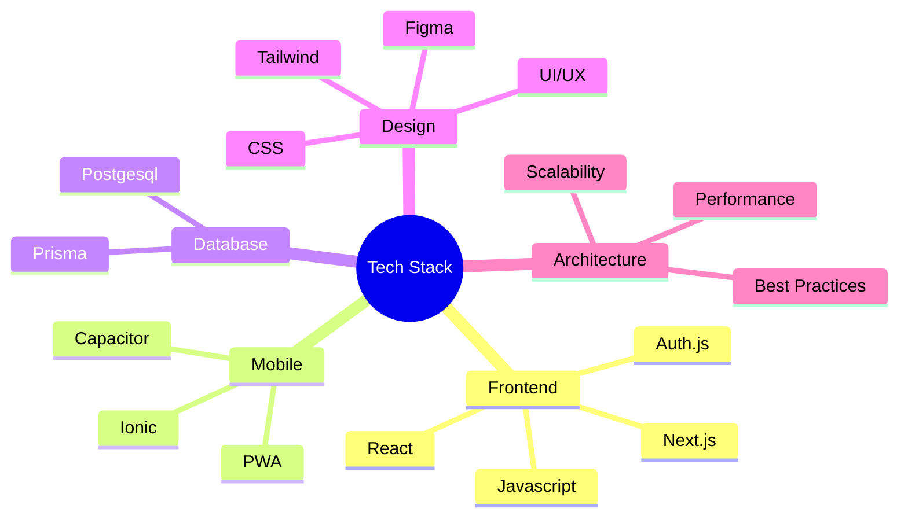

<h2 align="center">Hey, there! 👋</h2>

  I'm Code Sorcerer.  Frontend Development Lead 
  7+ years in JS dev
    
  Architecting <strong>top-notch UI</strong> with React, Next.js, Tailwind, Ionic 
  Innovative leader. 🚀
   
  <code>#FrontendDev</code> 🧙‍♂️
     

    
    
    
 

## 🌌 The Vision

In a world where logic meets soul, I craft digital experiences that speak louder than code—where every pixel breathes purpose.. This is where technology transcends code to become art.

## 🎭 The Architect's Canvas

  <table>
    <tr>
      <td align="center" width="400">
        <h3>🎨 Design Philosophy</h3>
        
<em>"Where intuition meets innovation, and simplicity dances with sophistication."</em>

      </td>
      <td align="center" width="400">
        <h3>🔮 Technical Mastery</h3>
        
<em>"Crafting tomorrow's solutions with today's technology, always one step ahead."</em>

      </td>
    </tr>
  </table>

## 🏛️ Current Endeavors

  💼 <strong>Frontend Development Lead</strong> @ UsedCarsNI
    
  
   
  <a  target="_blank">View my work gitlab contributions &rarr;</a>

<h4 align="center">Here are some things I spend time on 👇</h4>

    
    
 /p>

    
 /p>

## 🧙‍♂️ Skillset

  

---

## 🧠 Experience

### 🔹 [OrcaSplash](https://orcasplash.com/)
- Developed frontend using React, Next.js, and Tailwind CSS  
- Integrated backend APIs with Node.js and Prisma ORM  
- Implemented Stripe and PayPal payment gateways  
- Designed mobile-first UI for rental booking flow

### 🔹 [Polar Blades Rental](https://polarbladesrental.com/)
- Built full-stack platform using React, Next.js, and MongoDB  
- Integrated secure checkout with Stripe  
- Added booking calendar and inventory control features  
- Created admin panel for content and order management  

### 🔹 [MamasJunior](https://mamasjunior.com/)
- Developed WooCommerce store using custom WordPress theme  
- Added dynamic product filtering and user-friendly checkout  
- Set up responsive design with mobile optimization  
- Optimized site speed and SEO performance

### 🔹 [Free2Move](https://play.google.com/store/apps/details?id=com.free2move.app)
- Collaborated on Android app in Java/Kotlin  
- Integrated Firebase for authentication and cloud storage  
- Built GPS-based car location tracking feature  
- Conducted QA testing and performance optimization

### 🔹 [HelloDrew AI](https://www.hellodrew.ai)
- Created AI SaaS frontend with React and Tailwind CSS  
- Integrated OpenAI API for smart assistant features  
- Handled role-based access and user plan billing  
- Built dashboard with usage statistics

### 🔹 [Sol Tools](https://sol-tools-gamma.vercel.app/)
- Developed Solana blockchain tools with React.js  
- Added wallet integration and token management UI  
- Built reusable components for token explorers  
- Integrated charts to visualize blockchain metrics  

## 💡 Knowledge Arsenal

